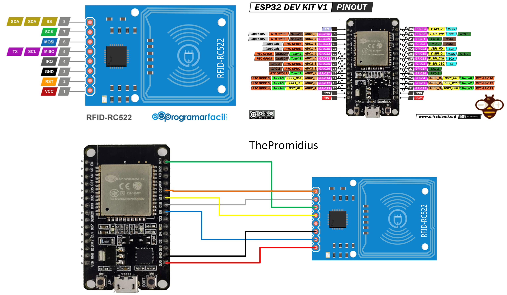

# Conexiones
En la siguiente imagen se aprecia las conexiones necesarias para poder leer las tarjetas.



# El codigo ejemplo

```cpp
#include <SPI.h>
#include <MFRC522.h>
/*************/
/* Constantes */

#define SERIAL_BITRATE 115200

/* RFID */
#define RFID_PIN_RESET 5
#define RFID_PIN_SPI 21
/* LUD LED DE PRUEBA*/
#define LED_PIN_LISTO 14
#define LED_PIN_DENEGADO 12
#define LED_PIN_PERMITIDO 13

#define TIEMPO_AUTORIZACION_SEGUNDOS 5

const String codigo_tarjeta_autorizada = "";

/**
 * Muestra la array de bytes
 * @param buffer: El la array de bytes
 * @param bufferSize: El tamaño de la array de bytes
 * **/
void mostrarByteArray(byte* buffer, byte bufferSize) {
    for (byte i = 0; i < bufferSize; i++) {
        Serial.print(buffer[i] < 0x10 ? " 0" : " ");
        Serial.print(buffer[i], HEX);
    }
    Serial.println("");
}

MFRC522 mfrc522 (RFID_PIN_SPI, RFID_PIN_RESET);

// Definimos una caja donde almacenar el codigo de la tarjeta. Esta caja pertenece a una clase. Piensalo como una caja que almacena diferentes cosas ordenadas.

MFRC522::MIFARE_Key clave = {keyByte: {0xFF, 0xFF, 0xFF, 0xFF, 0xFF, 0xFF}};


void setup()
{
  // Inicializamos cosas. El serial para mostrar texto en pantalla
    Serial.begin(SERIAL_BITRATE);
    // El spi, porque es el metodo de conexion al lector RFID
    SPI.begin();
    // El modulo RFID
    mfrc522.PCD_Init();

    delay(10);

    // Establecemos los pines de las luces led como salida (OUTPUT)
    pinMode(LED_PIN_LISTO, OUTPUT);
    pinMode(LED_PIN_DENEGADO , OUTPUT);
    pinMode(LED_PIN_PERMITIDO, OUTPUT);

    Serial.println("Setup Finalizado");
    digitalWrite(LED_PIN_LISTO,HIGH);
}
unsigned long tiempo_inicio;

void loop() {
    
    
    // El primer paso es comprobar si existe alguna tarjeta cerca
    if (!mfrc522.PICC_IsNewCardPresent()) {
        Serial.println("Esperando tarjeta");
        delay(500);
        return;
    }

    // Si hay una tarjeta cerca, que la eleccione, es decir que sea compatible, guarda la informacion en mfrc.uid
    // En caso contrario que no continúe
    if (!mfrc522.PICC_ReadCardSerial()) {
        Serial.println("Esperando tarjeta");
        delay(500);
        return;
    }
    // Pongo el pin de "listo" como low para indicar que se está procesando
    digitalWrite(LED_PIN_LISTO,LOW);

    // Mostramos el codigo de la tarjeta que hemos leido.
    mostrarByteArray(mfrc522.uid.uidByte, mfrc522.uid.size);  // Motrar el UID

    // Transformamos los bytes almacenados en mfrc522 y lo convertimos a tipo texto
    String strUID1 = String(mfrc522.uid.uidByte[0]) + "-" + String(mfrc522.uid.uidByte[1]) + "-" + String(mfrc522.uid.uidByte[2]) + "-" + String(mfrc522.uid.uidByte[3]);

    // Mostramos los bytes convertidos a texto
    Serial.println(strUID1);

    // Ejecutamos la autenticación.
    if (autenticar(strUID1)) {
      // Paso permitido
      tiempo_inicio = millis();
      while (tiempo_inicio  + TIEMPO_AUTORIZACION_SEGUNDOS * 1000 > millis() ){
          digitalWrite(LED_PIN_PERMITIDO,HIGH);
          Serial.println("autorizado");
          delay(1000);
      }

    } else {
      // Paso denegado
      digitalWrite(LED_PIN_DENEGADO,HIGH);
      Serial.println("denegado");
    }
    delay(1500);

    // Apagamos los leds de permitido y denegado y encendemos el de listo para volver a escanear otra tarjeta
    digitalWrite(LED_PIN_PERMITIDO,LOW);
    digitalWrite(LED_PIN_DENEGADO,LOW);
    digitalWrite(LED_PIN_LISTO,HIGH);
}


bool autenticar (String codigo_tarjeta) {
  Serial.println("Comparando "+ codigo_tarjeta + " con " + codigo_tarjeta_autorizada);
  // Si son iguales, devuelve True
  Serial.println(codigo_tarjeta == codigo_tarjeta_autorizada);
  return codigo_tarjeta == codigo_tarjeta_autorizada;
}```
