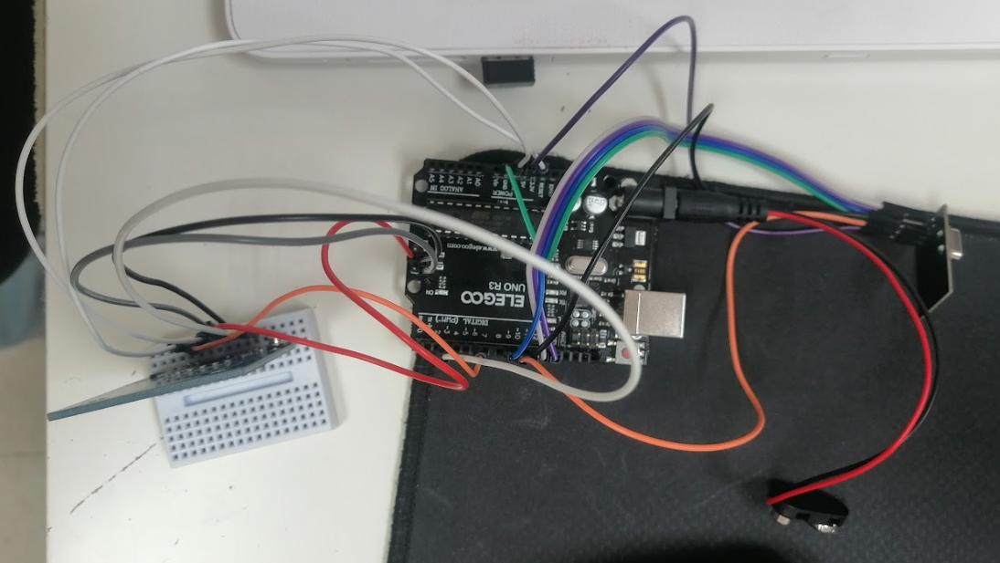
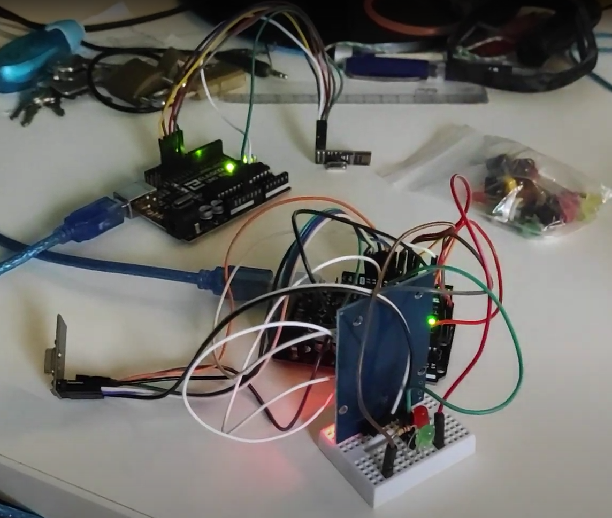
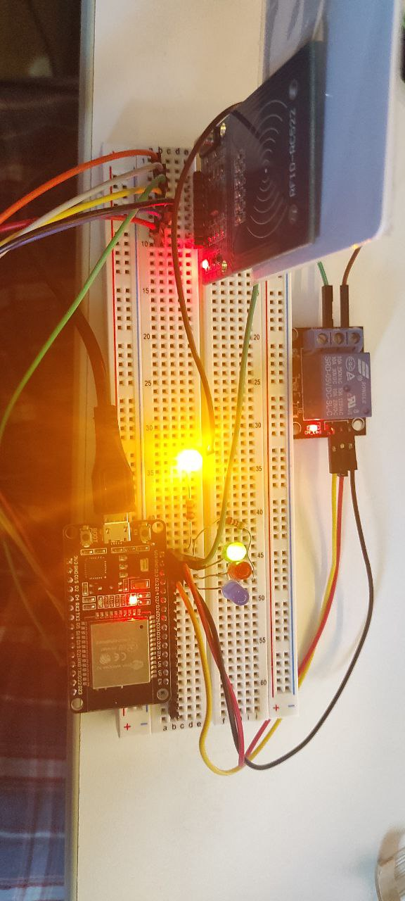
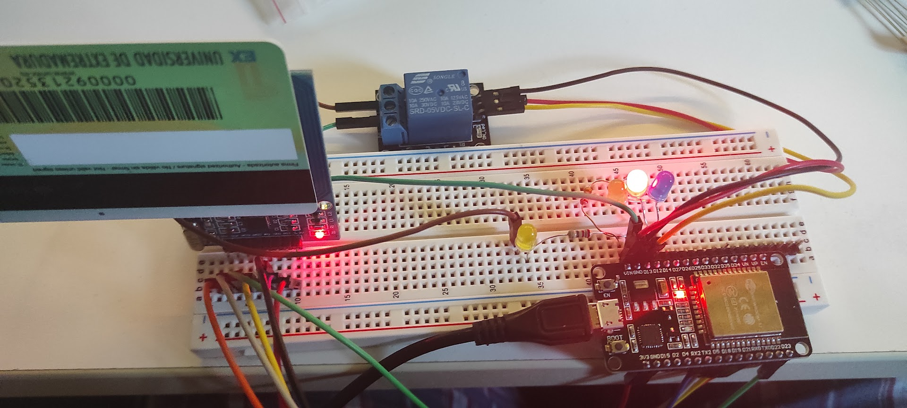

# Línea del tiempo

---

El proyecto se origina de la necesidad de tener un sistema de control de acceso centralizado para poder acceder a las instalaciones del FabLab

Originalmente se platea la idea de usar un lector de huellas pero no se llevó a cabo debido a las dificulates a la hora de realizar la implementación.

Se plantea hacer uso de las tarjetas RFID proporcionadas a los alumnos. Las cuales no tenían ningun uso.

# Conexión entre Arduinos

En un inicio se plantea hacer el proyecto con una comunicacion entre dos arduinos mediante módulos RF24.

# Primera implementación

En la imagen inferior se aprecia la primera implementacion.

Se hizo el experimento de conectarle una batería y se llevó a una de las puertas que se quería implementar para ver si el alcance de estos módulos llegaba.

Despues de multiples semanas de investigación se consigue programar el código que inicia la comunicacion entre los dos nodos para comprobar si el usuario tiene o no acceso.

El codigo del cliente se pueden consultar en los siguientes enlaces: [Programa del cliente](../conexion_entre_arduinos_RF24/NodoPuertaEstable/NodoPuertaEstable.ino) y [Programa del servidor](../conexion_entre_arduinos_RF24/NodoServidorEstable/NodoServidorEstable.ino)

### Resultado final:

En la siguiente imagen se puede apreciar los dos Arduninos funcionando y accionando unos leds que simulan el control de apertura de la puerta. Uno como servidor y otro como cliente

Se puede apreciar un video con el funcionamiento en el siguiente enlace: [VID_20221021_185443.mp4](videos%2FVID_20221021_185443.mp4)

# Conexión entre Arduino y RaspBerry

Originalmente el objetivo del proyecto era poder comunicar un arduino con una raspberri y que se comportara de la misma manera que lo hacen los dos arduinos. Siendo esta vez la raspberry la que decide si el usuario tiene acceso o no consultando una base de datos montadata en esta.

Despues de mucha pelea para que hubiera una comunicación minima entre el Arduino y la raspberry, se propuso la idea de utilizar un microcontrolador ESP32 con el que realizar la comunicacion mediante http.

# Conexión entre ESP32 y servidor Web

La conexión entre estos apenas puso impedimentos. Se consiguió simular un servidor web que recive el codigo rfid del usuario y responde con un codigo http:
- 200 si el acceso esta permitido.
- 401 si el acceso es denegado.
- 500 si el usuario no existe.

Se realiza el montaje de el nuevo con el nuevo microcontrolador.

En la siguiente imagen se puede apreciar el montaje haciendose una prueba de acceso en la que este esta permitido.
El led amarillo simula el sistema de cierre de la puerta.

Otra imagen del montaje en el que el acceso está denegado:
